iTerm2 has a lot of features. Every concievable desire a terminal user might have has been forseen and solved. These are just the main attractions!

<section class="feature-block">
### Split Panes
Divide a tab up into multiple panes, each one of which shows a different session. You can slice vertically and horizontally and create any number of panes in any imaginable arrangement. 
<a href="img/screenshots/split_panes_full.png" target="_blank">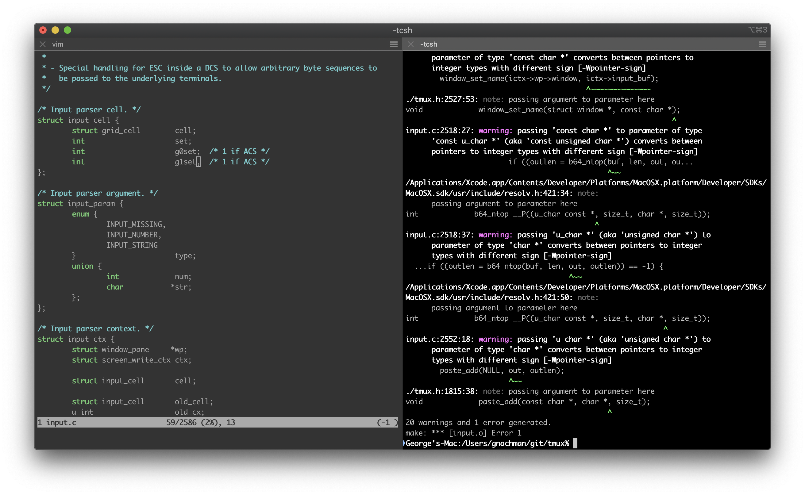</a>
Notice how inactive panes are slightly dimmed so it's easy to see which is active.

</section>
<section class="feature-block">
### Hotkey Window
Register a hotkey that brings iTerm2 to the foreground when you're in another application. A terminal is always a keypress away. You can choose to have the hotkey open a dedicated window. This gives you an always-available terminal (like Visor, Guake, or Yakuake) at your fingertips. 

</section>
<section class="feature-block">
### Search
iTerm2 comes with a robust find-on-page feature. The UI stays out of the way. All matches are immediately highlighted. Even regular expression support is offered! 
<a href="img/screenshots/search.png" target="_blank">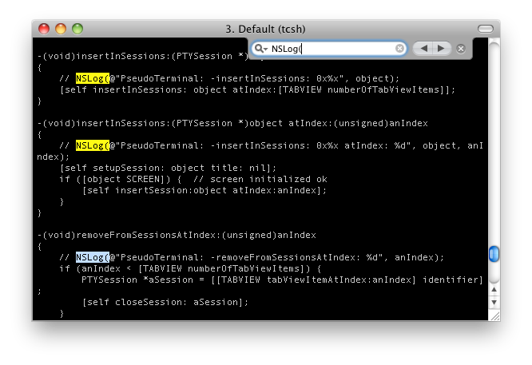</a>

</section>
<section class="feature-block">
### Autocomplete
Just type the start of any word that has ever appeared in your window and then Cmd-; will pop open a window with suggestions. The word you're looking for is usually on top of the list! 
<a href="img/screenshots/autocomplete.png" target="_blank">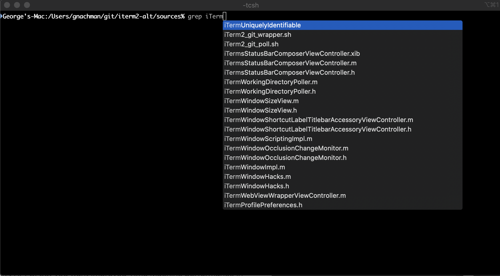</a>

</section>
<section class="feature-block">
### Mouseless Copy
Use the Find feature to begin searching for text. Press tab to expand the selection to the right or shift-tab to expand the selection to the left. Option-enter pastes the current match.
<a href="img/screenshots/mouselesscopy.gif" target="_blank">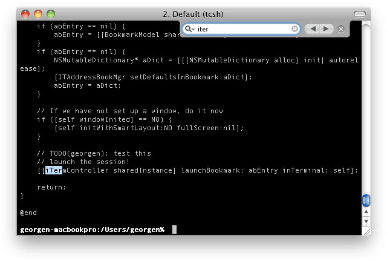</a>

</section>
<section class="feature-block">
### Paste History
Paste history lets you revisit recently copied or pasted text. You can even opt to have the history saved to disk so it will never be lost.

</section>
<section class="feature-block">
### Instant Replay
Instant replay lets you travel back in time. It's like TiVo for your terminal! 

</section>
<section>
### Configurability
Map any key to any function. Assign separate functions to each option key--or even remap all the modifier keys. You can customize iTerm2's appearance to suit your needs: enable transparency, background blur, background images, and much more. 

<a href="img/screenshots/v2-screen-shots/general.png" target="_blank">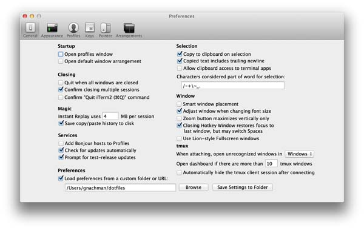</a>
<a href="img/screenshots/v2-screen-shots/appearance.png" target="_blank">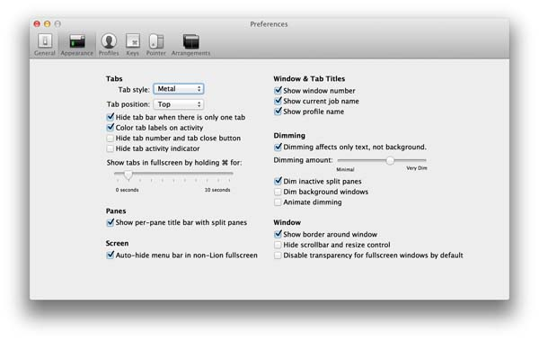</a>
<a href="img/screenshots/v2-screen-shots/profiles_general.png" target="_blank">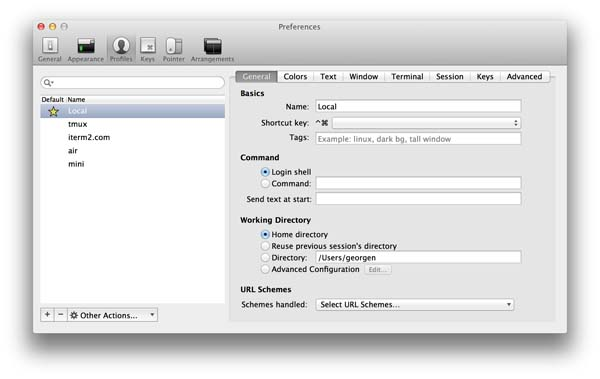</a>
<a href="img/screenshots/v2-screen-shots/profiles_colors.png" target="_blank">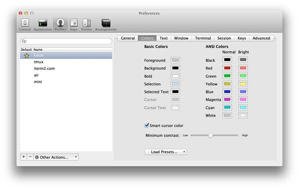</a>
<a href="img/screenshots/v2-screen-shots/profiles_text.png" target="_blank">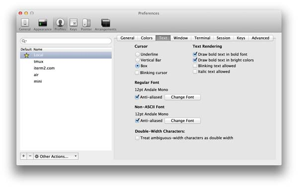</a>
<a href="img/screenshots/v2-screen-shots/profiles_window.png" target="_blank">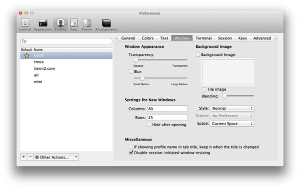</a>
<a href="img/screenshots/v2-screen-shots/profiles_terminal.png" target="_blank">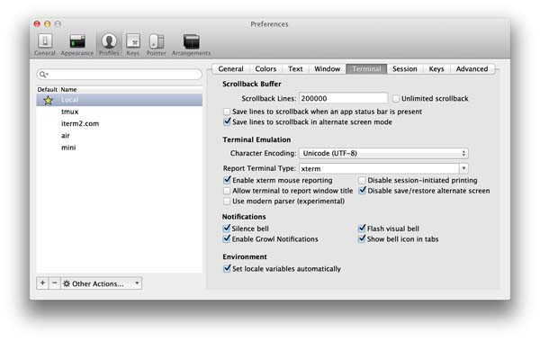</a>
<a href="img/screenshots/v2-screen-shots/profiles_session.png" target="_blank">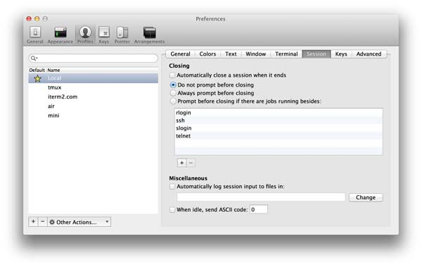</a>
<a href="img/screenshots/v2-screen-shots/profiles_keys.png" target="_blank">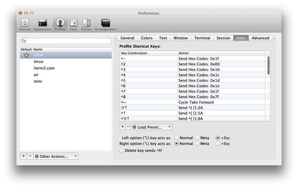</a>
<a href="img/screenshots/v2-screen-shots/profiles_advanced.png" target="_blank">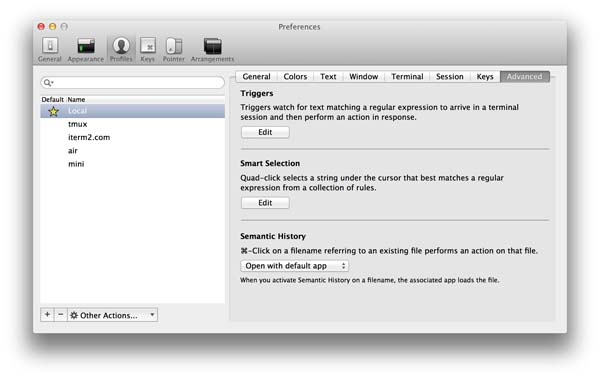</a>
<a href="img/screenshots/v2-screen-shots/profiles_keys.jpg" target="_blank">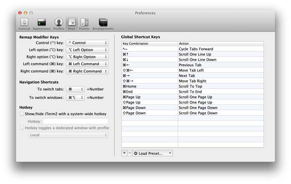</a>
<a href="img/screenshots/v2-screen-shots/profiles_pointer.png" target="_blank">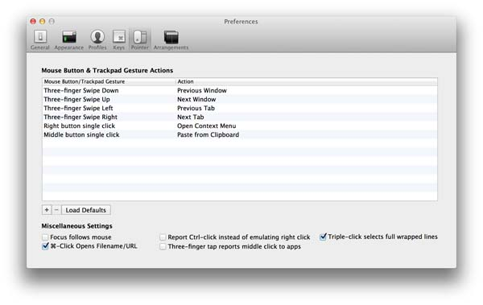</a>
<a href="img/screenshots/v2-screen-shots/profiles_arrangements.png" target="_blank">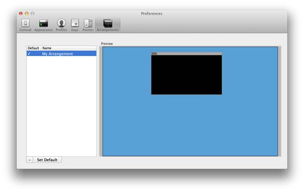</a>

</section>
<section class="feature-block">
### Unixyness
Coming from a Unix world? You'll feel at home with focus follows mouse, copy on select, middle button paste, and keyboard shortcuts to avoid mousing.

</section>
<section class="feature-block">
### 256 Colors (or more!)
With 256-color mode, Vim explodes with photorealism: the terminal is a medley of color and code comes alive. In version 3 (now in beta), 24-bit color is supported.
<a href="img/screenshots/256colors.png" target="_blank">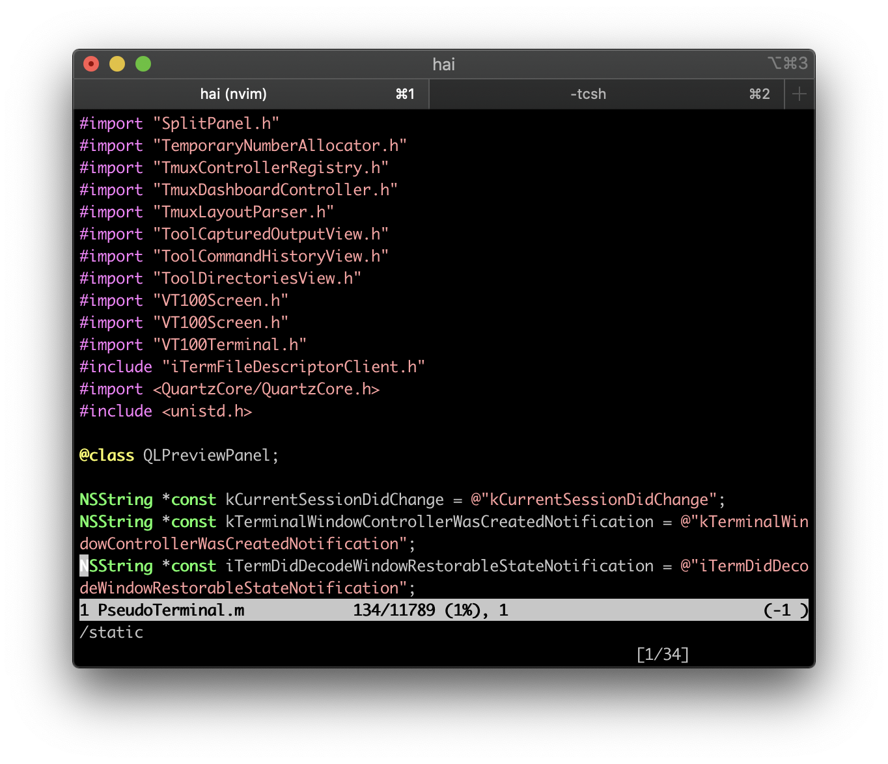</a>

</section>
<section class="feature-block">
### Readability
Do you lose your cursor when there are lots of different colors or have programs display hard-to-read color combinations? With the Smart Cursor Color and Minimum Contrast features, you can ensure that these problems are gone for good.

</section>
<section class="feature-block">
### Mouse Reporting
You can use the mouse to position the cursor, highlight text, and perform other functions in programs like Vim and Emacs with the mouse reporting feature.

</section>
<section class="feature-block">
### Growl Support
You can choose to receive Growl notifications of activity, bells, and more. Feel free to let a long job run in the background, secure in the knowledge that you'll know when it's done.
<a href="img/screenshots/growl.png" target="_blank">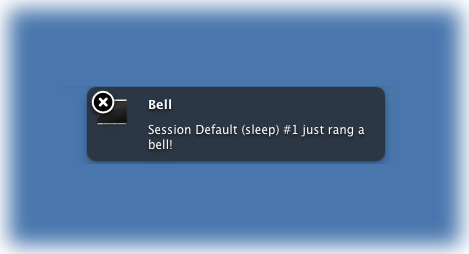</a>

</section>
<section class="feature-block">
### Exposé Tabs
Like OS X's Exposé feature, iTerm2 shows all your tabs on one screen. Better yet, you can search through them all at once. Go ahead and open as many tabs as you want--you can always find what you're looking for. 

</section>
<section class="feature-block">
### Tagged Profiles
Do you need to store separate configurations for many different hosts? iTerm2 provides a taggable and searchable profiles database so you can easily find the profile you're looking for.
<a href="img/screenshots/profiles1_full.png" target="_blank">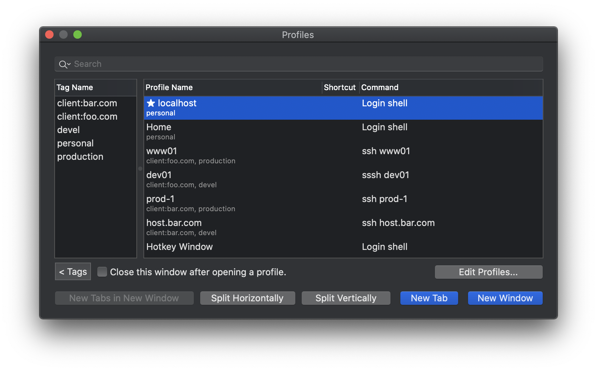</a>
<a href="img/screenshots/profiles2_full.png" target="_blank">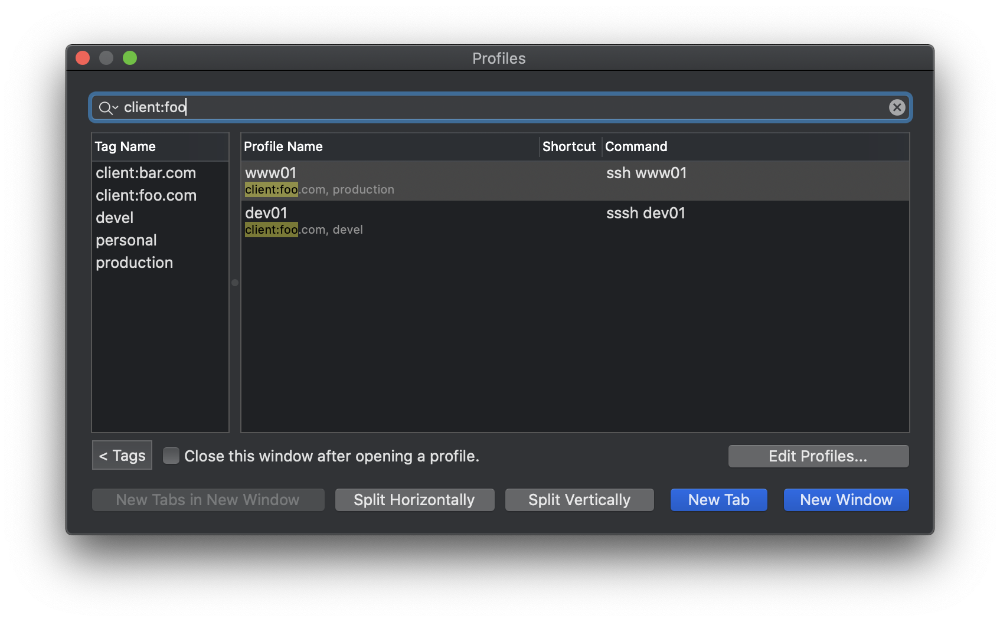</a>

</section>
<section class="feature-block">
### Multi-Lingual
iTerm2 features excellent internationalization support, including support for Unicode combining marks, double-width characters, and all Unicode planes.
<a href="img/screenshots/utf8.png" target="_blank">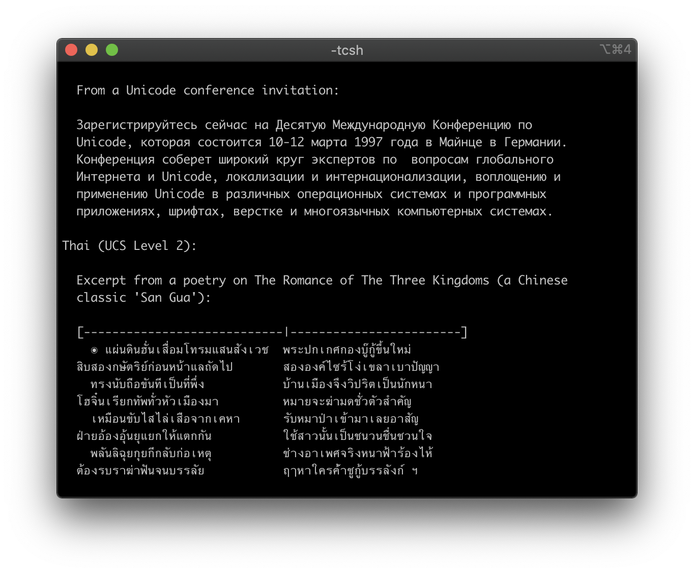</a>

</section>
<section class="feature-block">
### Triggers
iTerm2 supports user-defined triggers, which are actions that run when text matching a regular expression is received. You can use it to highlight words, automatically respond to prompts, notify you when something important happens, and more. 
<a href="img/screenshots/v2-screen-shots/triggers_full.png" target="_blank">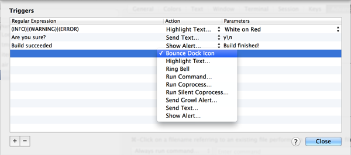</a>

</section>
<section class="feature-block">
### Smart Selection
iTerm2 can perform "smart selection" to highlight URLs, email addresses, filenames, and more by recognizing what is under the cursor and choosing how much text to select. 

</section>

## New in Version 3 (now in beta!)

<section class="feature-block">
### Shell Integration
iTerm2 can integration with your shell so it knows where your shell prompt is, what commands you're entering, which host your are on, and what your current directory is. This enables all sorts of cool features: you can easily navigate to previous shell prompts with &#8679;&#8984;&uarr; and &#8679;&#8984;&darr;. Your most used directories will be remembered for you. You can auto-complete previously used commands. And much more!
<a href="img/screenshots/v3-screen-shots/iterm2-shell-integration-navigation-demo.mov" target="_blank">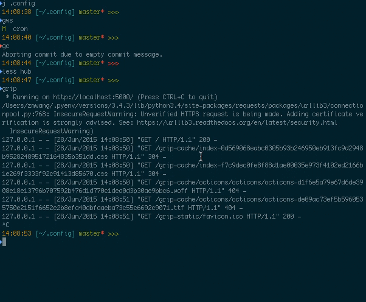</a>
</section>

<section class="feature-block">
### Automatic Profile Switching
Using the Shell Integration feature, you can have iTerm2 switch profiles depending on what you're doing. For example, you can define a profile that's always used when you ssh to some hostname. Or when your username is root. Or even when you're in a particular directory.

</section>

<section class="feature-block">
### Inline Images
iTerm2 has a custom escape sequence to display images right in the terminal. Even animated GIFs!

</section>

<section class="feature-block">
### Timestamps
You can see the last-modified time of every line in the terminal. It's useful to know how long a job took to complete, if the data you're looking at is fresh, or to try to piece together what you were doing before leaving for the weekend.

</section>

<section class="feature-block">
### Password Manager
Do you find yourself typing your password over and over again? Do you need to remember a bunch of passwords? Use iTerm2's built-in password manager. It stores your data securely encrypted in Mac OS X's keychain, protected by your user account's password. iTerm2 includes a safety mechanism that ensures your password only gets entered at a password prompt.

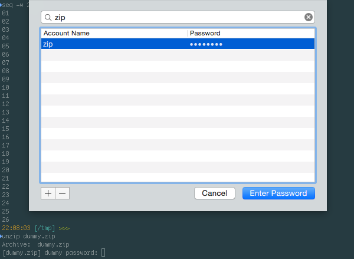
</section>

<section class="feature-block">
### Advanced Paste
With the Advanced Paste feature you can edit text before pasting it, convert it to base64, transform special characters, and more.

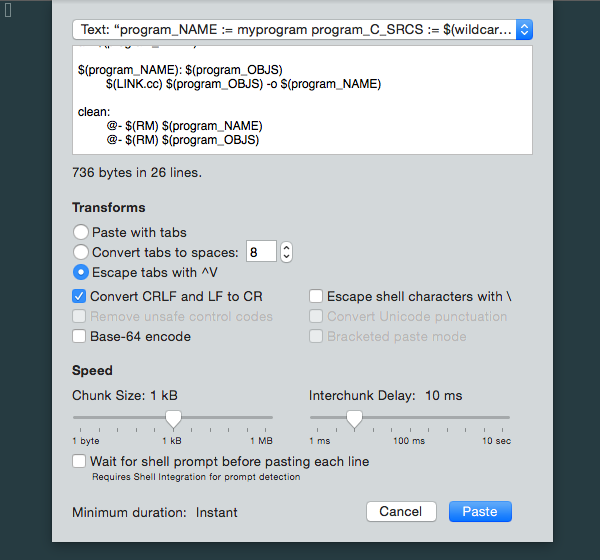
</section>

<section class="feature-block">
### Annotations
You can select text in your terminal and add an *annotation* to it in iTerm2. If you're puzzling through a big log file, it's useful to mark it up with what you've learned. Working through a disassembly? Make notes about what each register does. Free your mind!

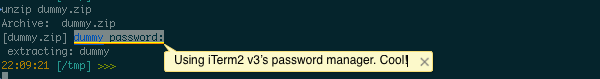
</section>

<section class="feature-block">
### Badges
You can put a *badge* in the top right of your terminal showing information about the current session. It can show your username, hostname, or even custom data like the current git branch.

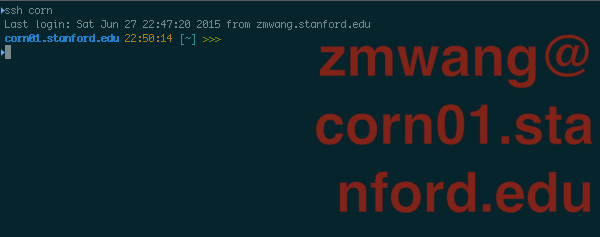
</section>

<section class="feature-block">
### Captured Output
Use iTerm2 as your IDE. When you build a big project, you used to have to pore over its output to find warnings and errors. No more! With the *captured output* feature, iTerm2 finds those messages (based on regular expressions you define) and shows them in the toolbelt. You can navigate right to each message. A double-click will run a coprocess of your choice, which can (for example) open the file in your favorite editor right to the line with the error.

<a href="img/screenshots/v3-screen-shots/iterm2-captured-output.mov" target="_blank">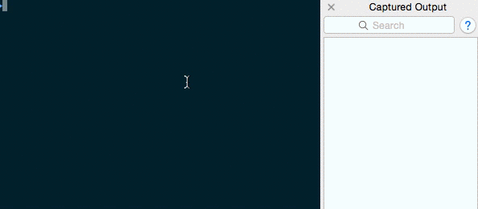</a>
</section>

